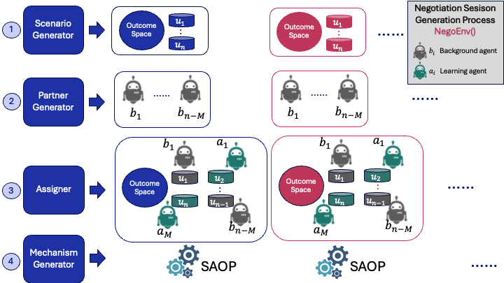

# Welcome to NegMAS-RL

NegMAS-RL is a library that simplify developing reinforcement learning agents for automated negotiation. It is based on the [NegMAS](https://negmas.readthedocs.io/en/latest/) library.

A negotiation session is defined by the components in the following figure:

- **Outcome Space** Defines the negotiation issues and the ranges for each of them.
- **Utility Functions** Define preferences of each partner in the negotiation (We use $n$ as the number of partners/ufuns in the negotiation).
- **Negotiators** Control each partner of the negotiation.

We define a **Scenario** as the outcome-space and preferences of all partners in the negotiation.

We separate he negotiations into two sets:

- **Background Negotiators** Negotiators that do not learn (or learn by their learning is not modeled) during the negotiation ($n - M$ of them from $p_1$ to $p_{n-M}$)
- **Learning Negotiators** Negotiators that learn during the negotiation ($M$ of them from $a_1$ to $a_M$).

## Components of the library

The main components of the library are:

- **Environment** We provide few environments that encapsulate negotiations as [gumnasium](https://gymnasium.farama.org/index.html) environments.
- **ObsEncoder** Manages how the learner(s) sees the environment (i.e. generates the observations of the agent).
- **ActionDecoder** Manages how the actions of the learner are converted to negotiation actions for the underlying negotiation mechanism
  (i.e. maps the actions space of the learner(s) to the actual actions supported by the negotiation mechanism).
- **RewardFunction** Generates rewards for the learner(s)

Types of environments supported in negmas-rl:

- **NegoEnv** Used in single agent reinforcement learning.
- **NegoMultiEnv** Used for multi-agent reinforcement learning.
- **SingleNegViewEnv** Used to represent a single multi-agent environment for multiple _independently learning_ agents.

## What environments do

The environment is responsible of encapsulating negotiations as [gumnasium](https://gymnasium.farama.org/index.html) environments.
The following figure show the moving parts of an environment in negmas-rl:

The process encapsulated by the environment follows the four main steps above until a negotiation is ready to run:

1. Whenever the environment needs to start a negotiation (e.g. in _reset()_ or in _step()_ after a negotiation is done),
   it calls the **ScenarioGenerator** to generate a new _Scenario_. A scenario is defined by the outcome-space and utility
   functions (preferences) as described earlier.
1. After getting the scenario, the environment calls the partner generator (**NegotiatorGenerator**) to generate the background negotiators
   (i.e. negotiators that are not learning using RL). In a single-agent RL application, all agents will be background agents except one. Moreover,
   **Placeholder** negotiators will be generated for each learner. These negotiators will just be used to pass the state to the learning model and
   pass the actions from the model to the negotiation.
1. Now that we have the scenario and all negotiators (both background negotiators from the partner generator and the placeholders for the learners), the
   environment will use the assigner (**NegotiatorAssigner**) to assign the background negotiators and placeholders to the utility functions of the scenario.
1. Finally, the environment uses the **MechanismGenerator** to generate a mechanism. It then _adds_ the background negotiators and placeholders with
   their assigned utility functions. Now the mechanism is ready to **run**. The environment then steps this mechanism in the **step()** function until
   the negotiation finishes.

Notes about this process:

- In every step, the environment will use the **RewardFunction** to pass rewards to all learners.
- When a negotiation ends, a new one is generated using the process described above until the environment is closed.

## Overall Process

The process of training an RL agent using the proposed library is shown in the following figure:

The multi-agent version is similar but uses multiple placeholders. The training process is shown in the following figure:

The testing process is similar to the singe-agent case but having multiple placeholders and models:

The deployment process is also the same.

Nevertheless, we can deploy just one of these agents instead of all of them

